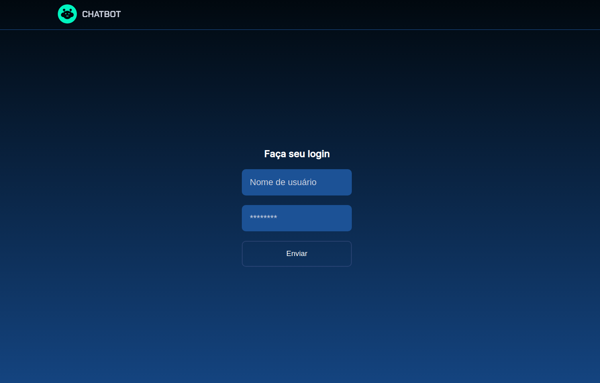
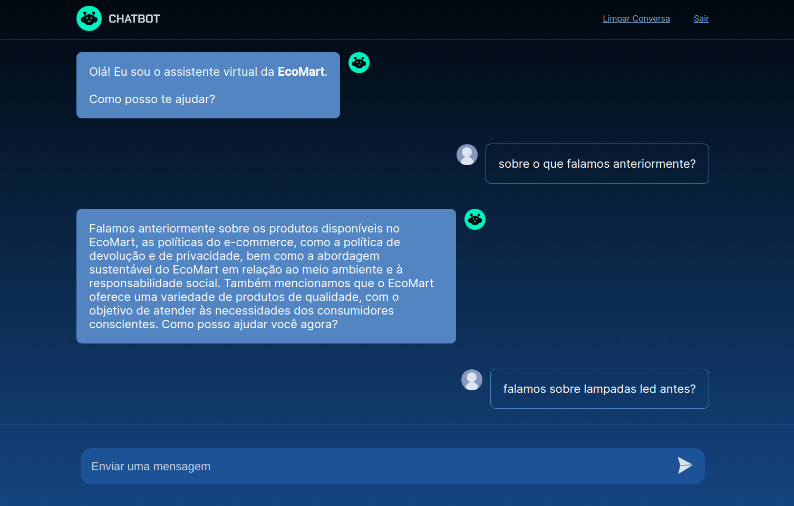

<h1 align="center">
    
</h1>

<h2 align="center">
  Ecomart
</h2>

<p align="center">
  <a href="#-tecnologias">Tecnologias</a>&nbsp;&nbsp;&nbsp;|&nbsp;&nbsp;&nbsp;
  <a href="#-projeto">Projeto</a>&nbsp;&nbsp;&nbsp;|&nbsp;&nbsp;&nbsp;
  <a href="#instalação">Instalação</a>&nbsp;&nbsp;&nbsp;|&nbsp;&nbsp;&nbsp;
  <a href="#instalação">Exemplo</a>
</p>


## 🚀 Tecnologias
Esse projeto foi desenvolvido com as seguintes tecnologias:

- [Django](https://www.djangoproject.com/)
- [OpenAI API](https://platform.openai.com/playground)

## 💻 Projeto
**O EcoMart é uma plataforma de comércio eletrônico dedicada a fornecer produtos ecológicos e sustentáveis para pessoas comprometidas com um estilo de vida mais consciente. Nós acreditamos que é possível viver de maneira sustentável sem comprometer a qualidade ou o conforto.**

## Instalação
### Pré requisitos
Ter instalado:
- [Python](https://www.python.org/downloads/)
- [Conda](https://conda.io/projects/conda/en/stable/user-guide/install/download.html)


### Run
```sh
# clonar repositório
git clone https://github.com/andre23arruda/ecomart-chatbot

# Entrar na pasta
cd ecomart-chatbot

# criar ambiente virtual
make venv

# instalar packages
make install

# ADICIONE OS VALORES CORRETOS em .env
cp .env_example .env

# Executar as migrações
make migrate

# Criar usuário
make superuser

# Start
make run
```

## Exemplo
<div align="center">
    
    <p>Login</p>
</div>
<hr>
<div align="center">
    
    <p>Chat</p>
</div>
<hr>